# Github Packages Gradle

_Easily add [GitHub Packages Repository](https://github.com/features/packages) to your `build.gradle(.kts?)` file with a
standardized credential configuration._

```kotlin
import no.ghpkg.github

plugins {
    kotlin("jvm") version "1.9.0"
    id("no.ghpkg")
    `maven-publish`
}

group = "org.example"
version = System.getenv().getOrDefault("VERSION", "UNVERSIONED")

repositories {
    mavenCentral()
    github("octocat", "hello-world")
}

configure<PublishingExtension> {
    repositories {
        github("example-org", "example-project")
    }
    publications {
        register<MavenPublication>("gpr") {
            from(components["kotlin"])
        }
    }
}
```

## Preparing your environment

First you must get two things from GitHub. Your GitHub username and a personal access token (PAT). You can find your
GitHub username [here](https://github.com/settings/profile). It's the name that is in parentheses at the top-left.
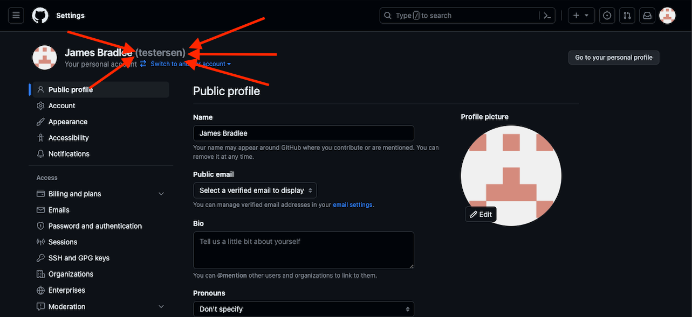

Next, you're going to need to create a GitHub Personal Access Token (PAT). Remember to save this token! You can create a
new token [here](https://github.com/settings/personal-access-tokens/new).

When creating the PAT you need to give it a reasonable name. You also need to set an expiration date, choose what's
appropriate for you, this token can be updated at later times easily. You also need to make sure that your username is
the one selected as the resource owner, I also recommend updating the repository access to **All repositories**.

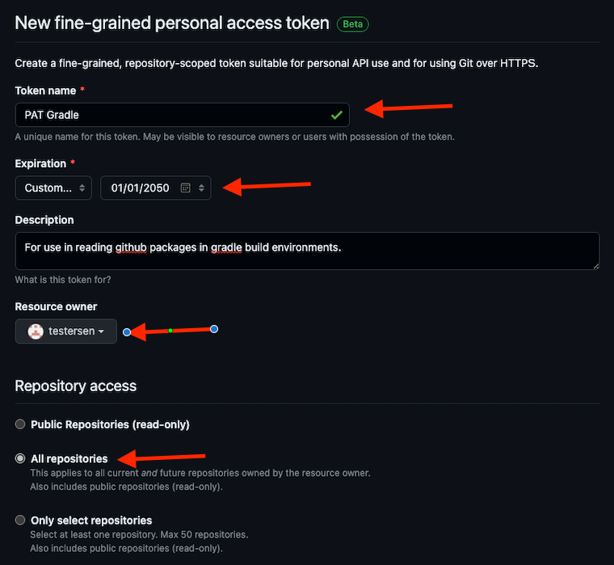

Now you need to update the permissions for the token. Find and click to expand the **Repository Permissions** button.

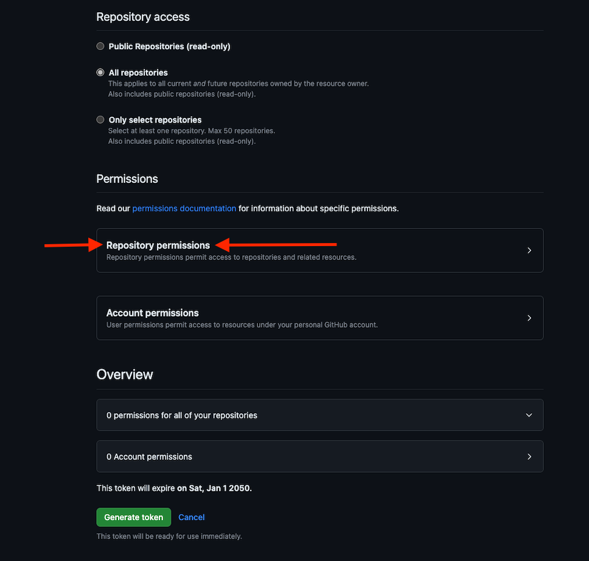

In the permissions list you should now look for **Contents**.

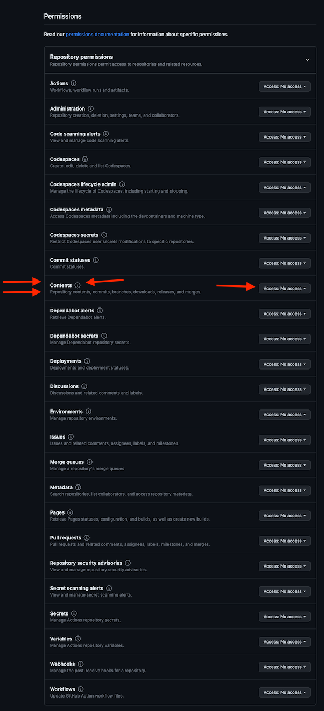

Change it to **Read-only**. Scroll all the way down and click **Generate token**

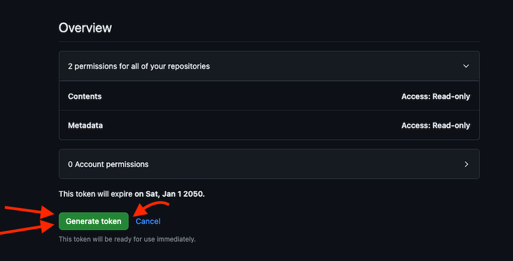

When you click the button it will show you the created PAT. Click the copy button to copy the secret.

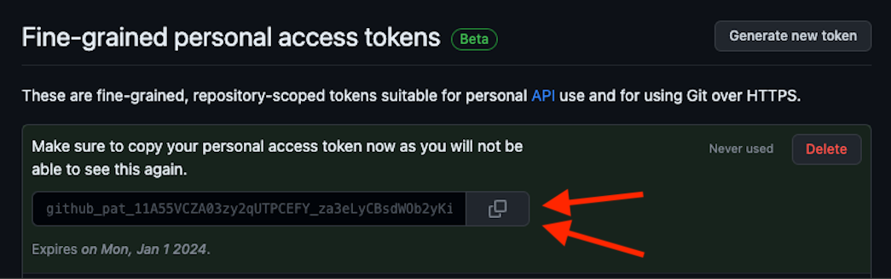

With this copied it is a good idea to temporarily place it in a text file. If you're on windows open Notepad.exe and
paste
your token in there. If you're on Mac you can open TextEdit and paste the token in there. If you're on Linux you may as
well open Vim and paste the token in there.

If you're on Linux, macOS or a Unix-like environment you can continue [here](#preparing-macos-or-linux). If you're on
Windows you can continue [here](#preparing-on-windows).

## Preparing macOS or Linux

Open a new terminal. Now you want to write the username and PAT to a shell configuration file of your choice.
Usually `.profile` works everywhere. But depending on your login shell you may also use `.bashrc`, `.zshrc`
or `.fishrc`.

You can run `echo $SHELL` to figure out which shell configuration file you should use.

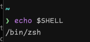

Replace `.profile` with your desired shell configuration file (optional).

Replace `username` with your GitHub username.

Replace `...` with your GitHub PAT.

```shell
echo "export GITHUB_ACTOR=\"username\"" >> ~/.profile
echo "export GITHUB_TOKEN=\"...\"" >> ~/.profile
```

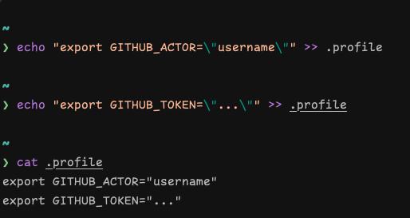

## Preparing on Windows

Press the `WIN` button and search for `environment`.

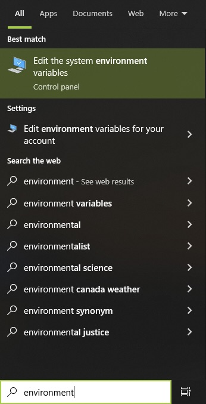

By now there should be a best match
with `Edit the system environment variables`. Click it and a new windows will appear. In the new Window click on
**Environment Variables**.

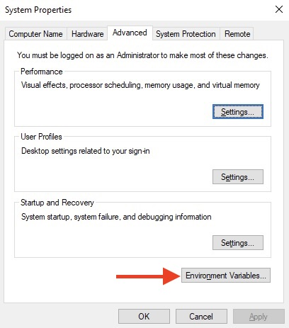

When you click the button a new window will open. Click the **New...** button inside
the `User variables for <username>`.

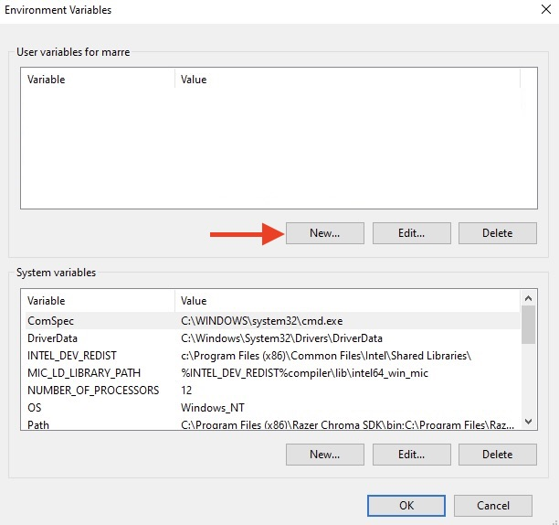

Write in Variable name: `GITHUB_ACTOR` with your GitHub username.

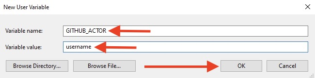

Press OK. Do the same again with the `GITHUB_TOKEN`.

Now press OK and Apply.

## Verify that it's working

To verify if this is working or not you can **restart** IntelliJ IDEA, open any project, click edit run configurations
and see if you can find GITHUB_ACTOR and GITHUB_TOKEN in the System Configurations.

If you don't see the variables in the system environment settings in the run options in IntelliJ you might've missed
something. Feel free to ask for help.

## GitHub Actions

```yaml
permissions:
  contents: read
  packages: write
steps:
  # ... prepare job ...
  - name: Publish package
    uses: gradle/gradle-build-action@749f47bda3e44aa060e82d7b3ef7e40d953bd629
    with:
      arguments: publish
    env:
      GITHUB_ACTOR: ${{ github.actor }}
      GITHUB_TOKEN: ${{ github.token }}
      VERSION: ${{ inputs.version }} 
```
